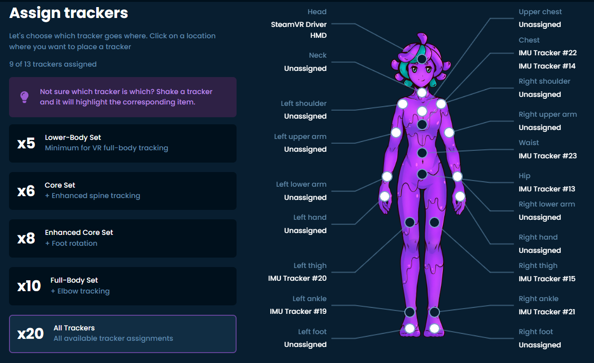

# fire-smol-slimes

A Smol Slime requires the following components:

- Receiver eByte Dongle (E104-BT5040U)
- USB-C battery charger
- Eight trackers
- Battery pack
- Compatible Inertial Measurement Unit (IMU)
- Compatible magnetometer
- Push button or momentary switch
- Slide switch
- Seeed Studio XIAO nRF52840 microcontroller
- Tracker Case with printed tracker positions and (L) (R) (L) (R) printed uniquely.

https://docs.shinebright.dev/diy/smol-slime.html

I saw some debate about eight trackers vs. 8+ trackers and information about receivers supporting 8+. How many trackers would you use for game development animation motion capture?

Lyall (1st Stacked Smolslime) — Today at 12:05
Receivers can support 8+, official is 8. Mileage above 8 may vary but for me it's fine

Can use multiple receivers to get around it if there's an issue

And I think 20 for mocap

iFire — Today at 12:06

So, like two receivers dongles? Or would you solo it?

Lyall (1st Stacked Smolslime) — Today at 12:06

I'd say that's a safe bet.

IMO I'd have one dongle for the main 10, and the other dongle for all the other points used for increased accuracy

1. **Head**
2. **Neck**
3. **Upper chest**
4. **Chest**
5. **Left shoulder**
6. **Right shoulder**
7. **Left upper arm**
8. **Right upper arm**
9. **Waist**
10. **Hip**
11. **Left lower arm**
12. **Right lower arm**
13. **Left hand**
14. **Right hand**
15. **Left thigh**
16. **Right thigh**
17. **Left ankle**
18. **Right ankle**
19. **Left foot**
20. **Right foot**
